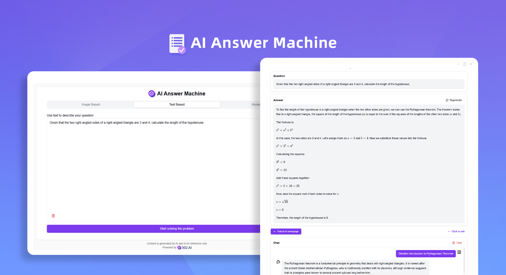
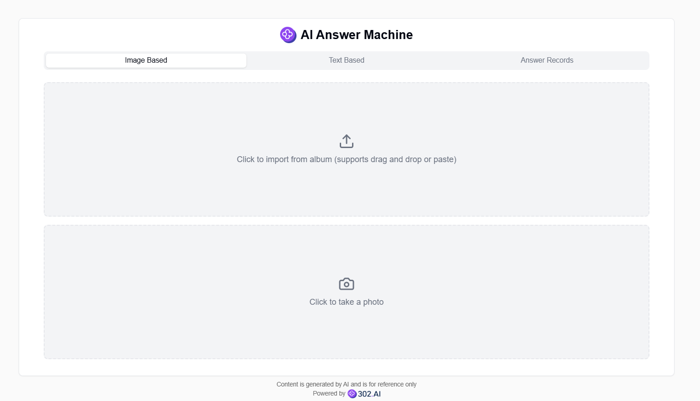
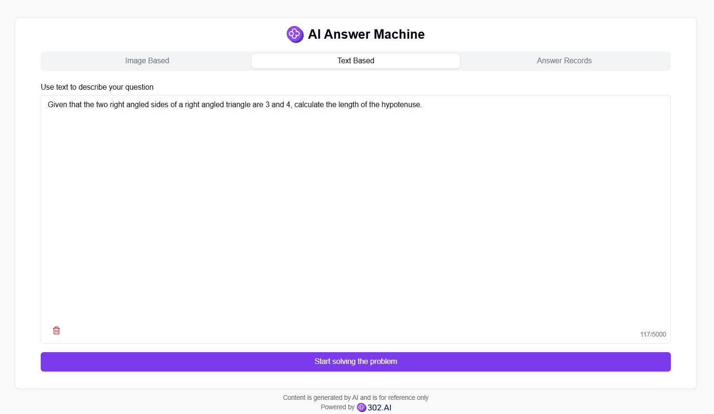
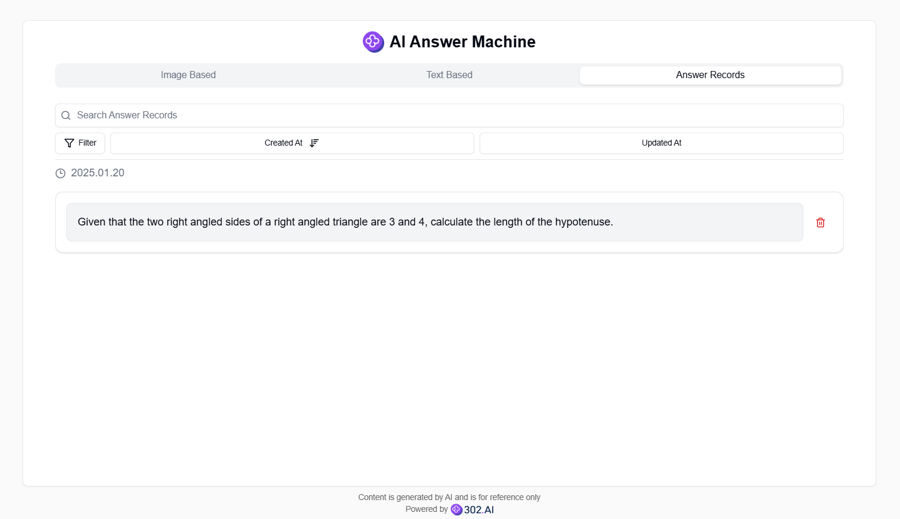

# <p align="center"> 📝 AI Answer Machine 🚀✨</p>

<p align="center">The AI Answer Machine provides three ways to submit questions: photo capture, photo import, and text input. It uses AI to generate detailed solution processes and allows follow-up questions based on the context.</p>

<p align="center"><a href="https://302.ai/en/tools/answer/" target="blank"></a></p >

<p align="center"><a href="README_zh.md">中文</a> | <a href="README.md">English</a> | <a href="README_ja.md">日本語</a></p>



This is the open-source version of the [AI Answer Machine](https://302.ai/en/tools/answer/) from [302.AI](https://302.ai/en/). You can directly log in to 302.AI to use the online version with zero code and zero background, or modify and deploy it yourself according to your requirements.


## Interface Preview
Support uploading images through photo gallery import or camera capture.


Support describing questions through text input.
     

AI generates detailed solution processes, including analysis and step-by-step explanations. You can ask follow-up questions, and AI will respond based on the context.
     

All questions and answers are saved in the exercise book for easy review.



## Project Features
### ✏️ Question Upload
Support three ways to submit questions: photo capture, photo import, and text input.
### ✒️ Question Solving
Use AI to generate detailed solution processes.
### 📖 History Records
All question records are saved in the exercise book for easy reference.
### 💬 Follow-up Questions
You can ask follow-up questions to AI, which will respond based on the current question context.
### 🌓 Dark Mode
It supports dark mode to protect your eyes.
### 🌍 Multi-language Support
- Chinese Interface
- English Interface
- Japanese Interface

## 🚩 Future Update Plans
- [ ] Create a massive question bank
- [ ] Support more question types


## 🛠️ Tech Stack

- **Framework**: Next.js 14
- **Language**: TypeScript
- **Styling**: TailwindCSS
- **UI Components**: Radix UI
- **State Management**: Jotai
- **Form Handling**: React Hook Form
- **HTTP Client**: ky
- **i18n**: next-intl
- **Theming**: next-themes
- **Code Standards**: ESLint, Prettier
- **Commit Standards**: Husky, Commitlint

## Development & Deployment
1. Clone the project
```bash
git clone https://github.com/302ai/302_ai_answer_machine
cd 302_ai_answer_machine
```

2. Install dependencies
```bash
pnpm install
```

3. Configure environment
```bash
cp .env.example .env.local
```
Modify the environment variables in `.env.local` as needed.

4. Start development server
```bash
pnpm dev
```

5. Build for production
```bash
pnpm build
pnpm start
```


## ✨ About 302.AI ✨
[302.AI](https://302.ai/en/) is an enterprise-oriented AI application platform that offers pay-as-you-go services, ready-to-use solutions, and an open-source ecosystem.✨
1. 🧠 Comprehensive AI capabilities: Incorporates the latest in language, image, audio, and video models from leading AI brands.
2. 🚀 Advanced application development: We build genuine AI products, not just simple chatbots.
3. 💰 No monthly fees: All features are pay-per-use, fully accessible, ensuring low entry barriers with high potential.
4. 🛠 Powerful admin dashboard: Designed for teams and SMEs - managed by one, used by many.
5. 🔗 API access for all AI features: All tools are open-source and customizable (in progress).
6. 💡 Powerful development team: Launching 2-3 new applications weekly with daily product updates. Interested developers are welcome to contact us.