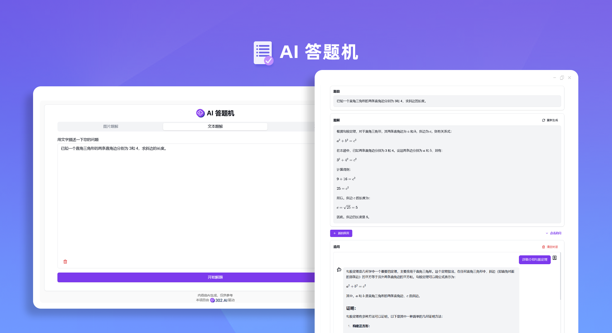
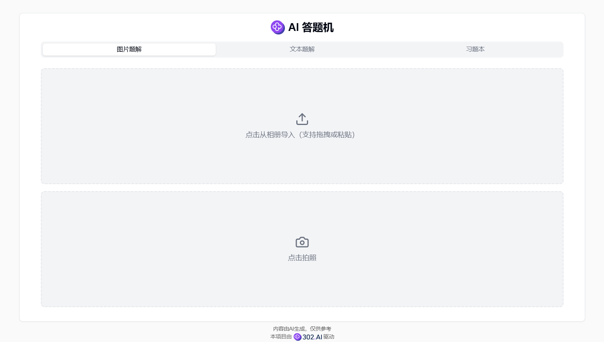
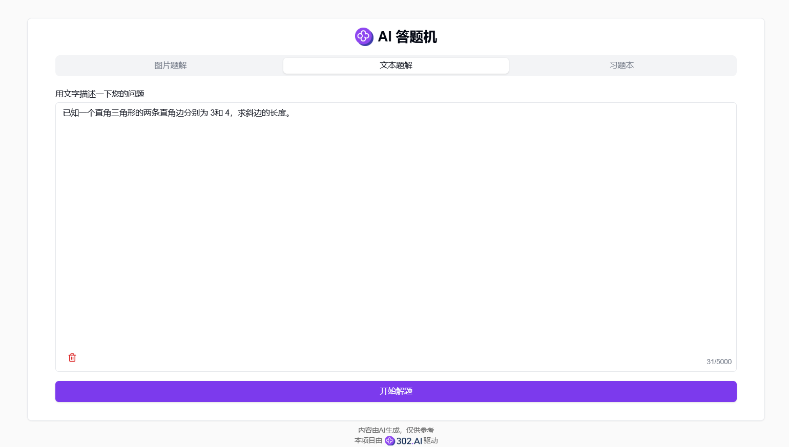
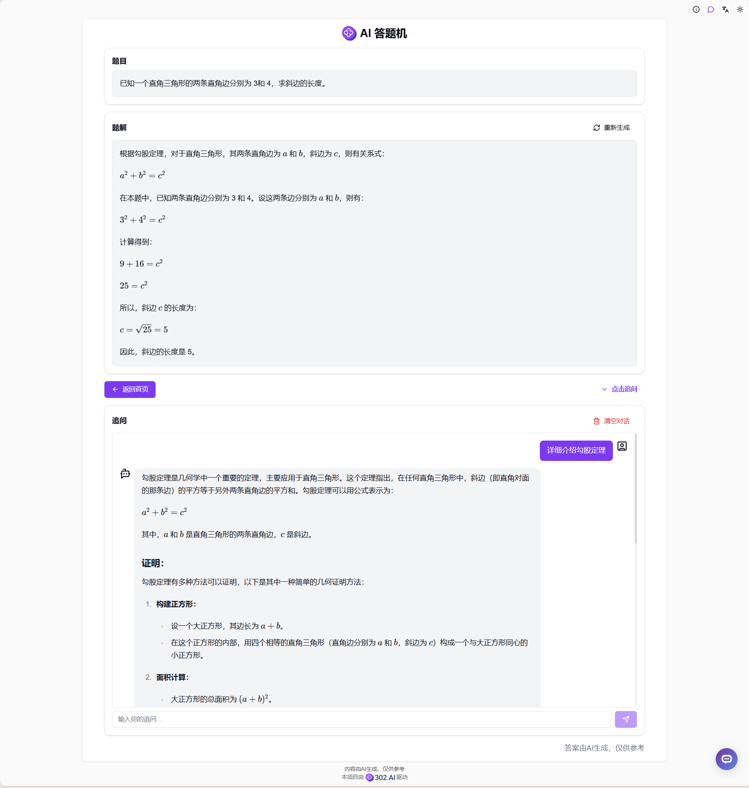

# <p align="center"> 📝 AI 答题机 🚀✨</p>

<p align="center">AI答题机提供拍照、相册导入和文字输入三种方式上传题目，使用AI生成题目解答过程，还可以将题目作为上下文对AI进行追问。</p>

<p align="center"><a href="https://302.ai/tools/answer/" target="blank"></a></p >

<p align="center"><a href="README_zh.md">中文</a> | <a href="README.md">English</a> | <a href="README_ja.md">日本語</a></p>




来自[302.AI](https://302.ai)的[AI答题机](https://302.ai/tools/answer/)的开源版本。你可以直接登录302.AI，零代码零配置使用在线版本。或者对本项目根据自己的需求进行修改，传入302.AI的API KEY，自行部署。

## 界面预览
支持从相册导入或拍照上传图片进行搜题。


支持文字描述题目进行搜题。
     

AI会生成详细的解题过程，包括思路分析和步骤说明。可以对AI的解答进行追问，AI会根据上下文继续解答。
     

所有的题目和解答都会保存在习题本中，方便随时复习。


## 项目特性
### ✏️ 题目上传
支持拍照、相册导入和文字输入三种方式上传题目。  
### ✒️ 题目解答
使用AI生成题目解答过程。
### 📖 历史记录
所有搜题记录将会保存至习题本，方便用户查看。
### 💬 题目追问
可以对AI进行追问，将当前题目作为上下文，AI会根据题目和追问内容进行解答。
### 🌓 暗色模式
支持暗色模式，保护您的眼睛。
### 🌍 多语言支持
  - 中文界面
  - English Interface
  - 日本語インターフェース

## 🚩 未来更新计划
- [ ] 创建海量题库
- [ ] 支持更多题型 

## 🛠️ 技术栈

- **框架**: Next.js 14
- **语言**: TypeScript
- **样式**: TailwindCSS
- **UI组件**: Radix UI
- **状态管理**: Jotai
- **表单处理**: React Hook Form
- **HTTP客户端**: ky
- **国际化**: next-intl
- **主题**: next-themes
- **代码规范**: ESLint, Prettier
- **提交规范**: Husky, Commitlint


## 开发&部署
1. 克隆项目
```bash
git clone https://github.com/302ai/302_ai_answer_machine
cd 302_ai_answer_machine
```

2. 安装依赖
```bash
pnpm install
```

3. 环境配置
```bash
cp .env.example .env.local
```
根据需要修改 `.env.local` 中的环境变量。

4. 启动开发服务器
```bash
pnpm dev
```

5. 构建生产版本
```bash
pnpm build
pnpm start
```


## ✨ 302.AI介绍 ✨
[302.AI](https://302.ai)是一个面向企业的AI应用平台，按需付费，开箱即用，开源生态。✨
1. 🧠 集合了最新最全的AI能力和品牌，包括但不限于语言模型、图像模型、声音模型、视频模型。
2. 🚀 在基础模型上进行深度应用开发，我们开发真正的AI产品，而不是简单的对话机器人
3. 💰 零月费，所有功能按需付费，全面开放，做到真正的门槛低，上限高。
4. 🛠 功能强大的管理后台，面向团队和中小企业，一人管理，多人使用。
5. 🔗 所有AI能力均提供API接入，所有工具开源可自行定制（进行中）。
6. 💡 强大的开发团队，每周推出2-3个新应用，产品每日更新。有兴趣加入的开发者也欢迎联系我们